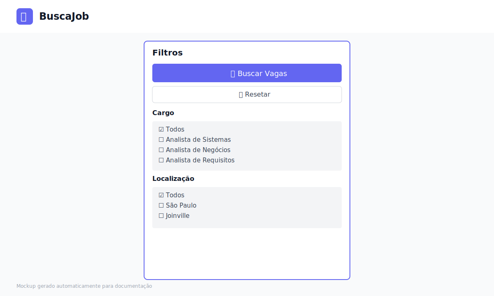
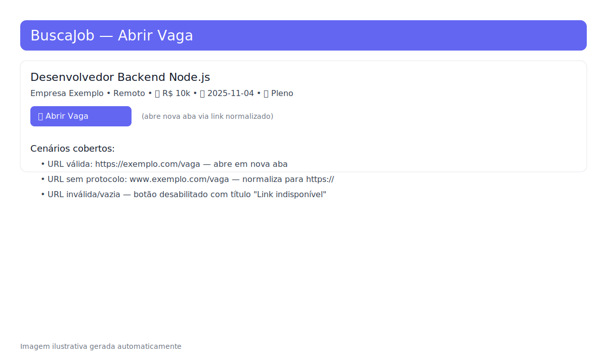

# BuscaJob

Aplicação fullstack para agregação e busca de vagas de emprego, composta por um backend em Python (Flask) e um frontend moderno em React.

## 🚀 Funcionalidades

- **Busca Unificada**: Pesquise vagas em múltiplos sites simultaneamente.
- **Filtros Avançados**: Refine por cargo, localização, nível de experiência, modalidade e tipo de contrato.
- **Visualização Clara**: Lista de resultados limpa com detalhes essenciais.
- **Favoritos**: Salve vagas de interesse.
- **Exportação**: Exporte resultados para Excel ou JSON.
- **Relatórios**: Geração automática de relatórios de vagas.
- **Interface Responsiva**: Design moderno utilizando Tailwind CSS.

## 🛠️ Tecnologias

### Backend
- **Python 3.10+**
- **Flask**: Servidor API RESTful.
- **BeautifulSoup4**: Web Scraping.
- **Pandas**: Processamento de dados e exportação.
- **Schedule**: Agendamento de tarefas em background.

### Frontend
- **React 18**: Biblioteca de interface.
- **Vite**: Build tool de alta performance.
- **TypeScript**: Desenvolvimento tipado e seguro.
- **Tailwind CSS**: Estilização utilitária.
- **React Query**: Gerenciamento de estado do servidor e cache.

## 📋 Pré-requisitos

- **Node.js** (v18 ou superior)
- **Python** (v3.10 ou superior)
- **Git**

## 🔧 Instalação e Execução

Para rodar o projeto completo, você precisará de dois terminais: um para o Backend e outro para o Frontend.

### 1. Backend (API)

O backend roda na porta `5000` por padrão.

```powershell
# Na raiz do projeto (c:\BuscaJob)

# 1. Crie o ambiente virtual (caso não tenha criado)
python -m venv .venv

# 2. Ative o ambiente virtual
.\.venv\Scripts\Activate.ps1

# 3. Instale as dependências
pip install -r BuscaJobBackEnd/requirements.txt

# 4. Inicie o servidor
python BuscaJobBackEnd/api_server.py
```
*Aguarde a mensagem indicando que o servidor está rodando (ex: `Running on http://127.0.0.1:5000`).*

### 2. Frontend (Interface)

O frontend roda geralmente na porta `5173`.

Abra um **novo terminal** e execute:

```powershell
# 1. Acesse a pasta do frontend
cd BuscaJobFrontEnd

# 2. Instale as dependências
npm install

# 3. Inicie o servidor de desenvolvimento
npm run dev
```

Acesse a aplicação em: `http://localhost:5173` (ou a URL indicada no terminal).

## ⚙️ Configuração

O frontend espera que a API esteja em `http://localhost:5000`. Se precisar alterar, crie/edite o arquivo `.env` na pasta `BuscaJobFrontEnd`:

```env
VITE_API_URL=http://sua-api-url:5000
```

## 📸 Screenshots

### Home


### Filtros


### Detalhes da Vaga


## 📁 Estrutura do Projeto

```
BuscaJob/
├── BuscaJobBackEnd/      # API Flask e Scripts de Scraping
│   ├── api_server.py     # Ponto de entrada da API
│   ├── job_scraper.py    # Lógica de scraping
│   ├── requirements.txt  # Dependências Python
│   └── ...
├── BuscaJobFrontEnd/     # Aplicação React
│   ├── src/              # Código fonte do frontend
│   ├── package.json      # Dependências Node.js
│   └── ...
└── docs/                 # Documentação e assets
```

## 🔄 Endpoints da API

Principais rotas disponíveis no Backend:

- `GET /`: Status da API.
- `POST /api/buscar-vagas`: Realiza a busca com base nos critérios (JSON).
- `GET /api/ultimo-resultado`: Retorna o último JSON de vagas gerado.
- `GET /api/relatorio-fixo`: Gera um relatório predefinido.
- `POST /api/exportar-vagas`: Exporta as vagas atuais para Excel ou JSON.
- `GET /api/estatisticas`: Retorna estatísticas de uso.

---
